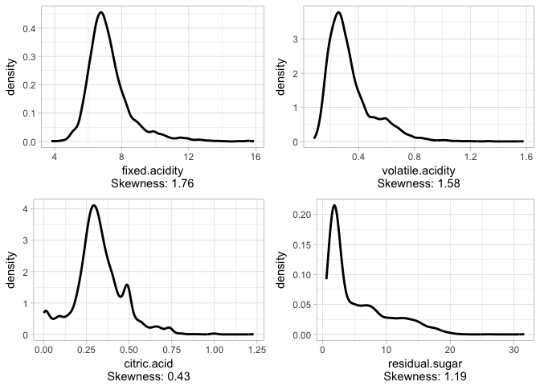
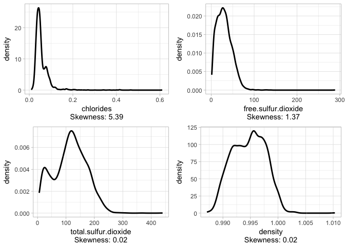
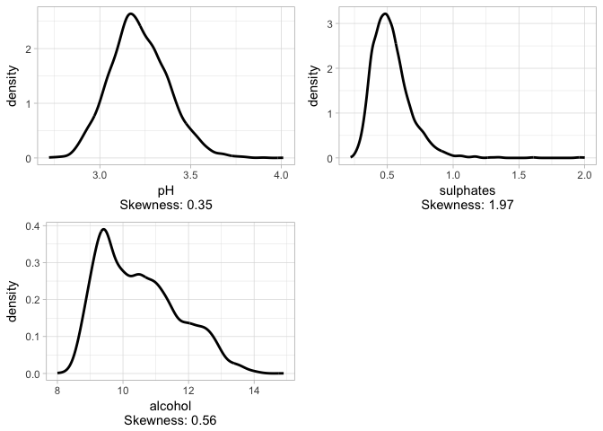
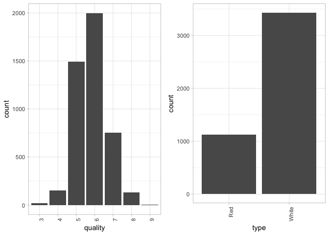
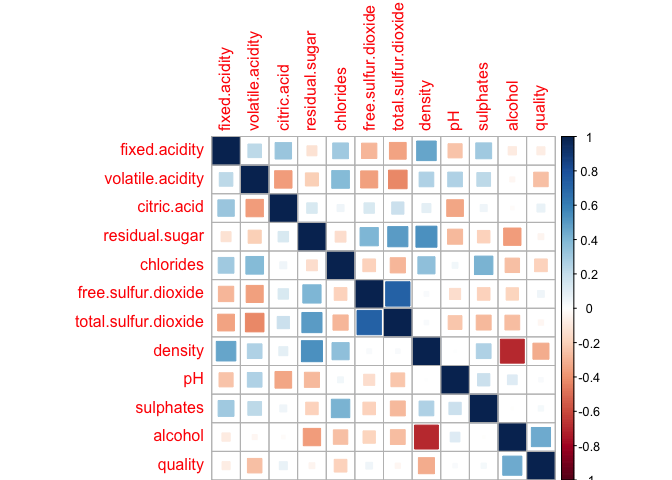
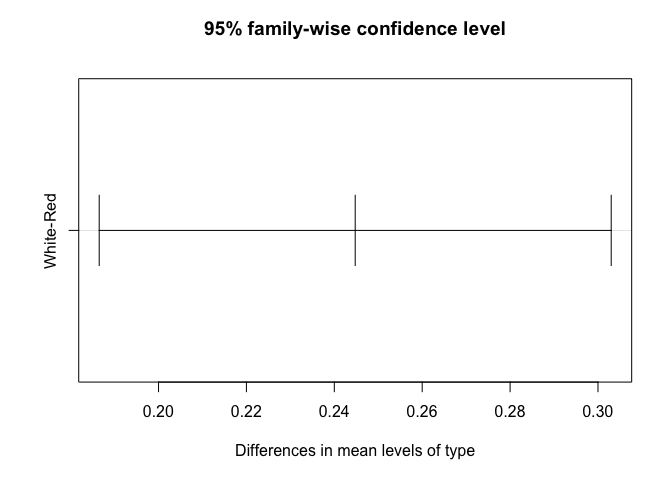

Exploratory Data Analysis on the Wine Quality Dataset
================

**Prepare the Problem**

``` r
# 1. Prepare Problem
# a) Load libraries
library(ggplot2)
library(caret)
```

    ## Warning: package 'caret' was built under R version 3.2.5

    ## Loading required package: lattice

``` r
library(corrplot)
```

    ## Warning: package 'corrplot' was built under R version 3.2.5

``` r
library(gridExtra)
```

    ## Warning: package 'gridExtra' was built under R version 3.2.4

``` r
library(e1071)
# b) Load dataset
wine.white <- read.table("winequality-white.csv",header = T,sep=";")
wine.red <- read.table("winequality-red.csv",header = T,sep=";")
wine.white$type <- "White"
wine.red$type <- "Red"
wine.full <- rbind(wine.white,wine.red)
# c) Split-out validation dataset
trainRows <- createDataPartition(1:nrow(wine.full),p=.7,list = F)
trainSet <- wine.full[trainRows,]
testSet <- wine.full[-trainRows,]
```

**Exploratory Data Analysis**

``` r
#Functions for plotting the data
plotHist <- function(data_in, i) {
  data <- data.frame(x=data_in[[i]])
  p <- ggplot(data=data, aes(x=factor(x))) + stat_count() + xlab(colnames(data_in)[i]) + theme_light() + 
    theme(axis.text.x = element_text(angle = 90, hjust =1))
  return (p)
}

plotDen <- function(data_in, i){
  data <- data.frame(x=data_in[[i]])
  p <- ggplot(data= data) + geom_line(aes(x = x), stat = 'density', size = 1,alpha = 1.0) +
    xlab(paste0((colnames(data_in)[i]), '\n', 'Skewness: ',round(skewness(data_in[[i]], na.rm = TRUE), 2))) + theme_light() 
  return(p)
  
}

plotCorr <- function(data_in, i){
  data <- data.frame(x = data_in[[i]], quality = data_in$quality)
  p <- ggplot(data, aes(x = x, y = quality)) + geom_point(shape = 1, na.rm = TRUE) + geom_smooth(method = lm ) + xlab(paste0(colnames(data_in)[i], '\n', 'R-Squared: ', round(cor(data_in[[i]], data$quality), 2))) + theme_light()
  return(suppressWarnings(p))
}

doPlots <- function(data_in, fun, ii, ncol=3) {
  pp <- list()
  for (i in ii) {
    p <- fun(data_in=data_in, i=i)
    pp <- c(pp, list(p))
  }
  do.call("grid.arrange", c(pp, ncol=ncol))
}
```

**Density Plots for Continuous Variables** The density plots of the features indicate that the features are skewed.

``` r
doPlots(trainSet[,1:11],fun=plotDen,ii=1:4,ncol = 2)
```



``` r
doPlots(trainSet[,1:11],fun=plotDen,ii=5:8,ncol = 2)
```



``` r
doPlots(trainSet[,1:11],fun=plotDen,ii=9:11,ncol = 2)
```



**Histograms for the Categorical Variables**

``` r
doPlots(trainSet[,12:13],fun=plotHist,ii=1:2,ncol = 2)
```

 The distribution of quality, the response variable, is already normal so there is no more need to transform the data.

**Correlation Matrix**

``` r
#How are the variables corelated to one another?
correlations <-cor(trainSet[,sapply(trainSet,is.numeric)])
corrplot(correlations,method = "square")
```



The correlation matrix above suggests that none of the predictors are highly correlated to the quality of the wine

Notable variables with relatively high correlation with quality: \* volatile.acidity \* chlorides \* density \* alcohol

**ANOVA Test for Categorical Variables**

``` r
type.aov <- aov(quality ~ type,data=trainSet)
anova(type.aov)
```

    ## Analysis of Variance Table
    ## 
    ## Response: quality
    ##             Df Sum Sq Mean Sq F value    Pr(>F)    
    ## type         1   50.6  50.574  67.846 2.288e-16 ***
    ## Residuals 4547 3389.4   0.745                      
    ## ---
    ## Signif. codes:  0 '***' 0.001 '**' 0.01 '*' 0.05 '.' 0.1 ' ' 1

``` r
TukeyHSD(type.aov)
```

    ##   Tukey multiple comparisons of means
    ##     95% family-wise confidence level
    ## 
    ## Fit: aov(formula = quality ~ type, data = trainSet)
    ## 
    ## $type
    ##                diff       lwr       upr p adj
    ## White-Red 0.2447533 0.1864986 0.3030079     0

``` r
plot(TukeyHSD(type.aov))
```

 The analysis of variance (ANOVA) on the type categorical variable yielded significant variation as seen above. A post hoc Tukey Test showed that the white wines and red wines differed significantly at p &lt; .05.
